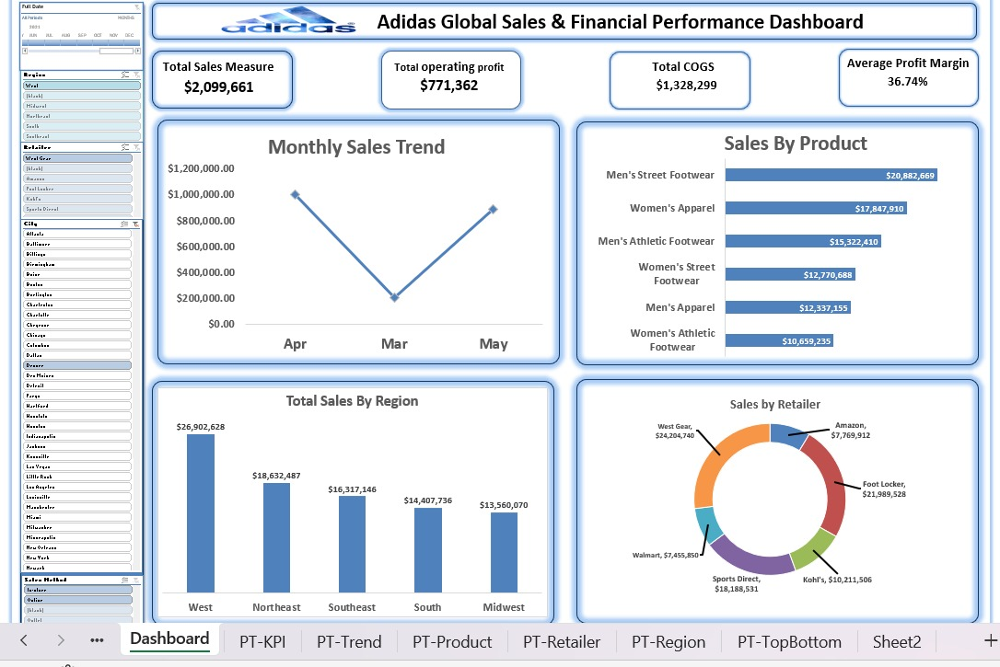

# Adidas Global Sales & Financial Performance Dashboard 📊👟

## 📝 Project Overview
Adidas' retail performance is spread across multiple regions, retailers, sales channels, and product lines. The objective of this project is to build an interactive Excel dashboard using Power Pivot and DAX to analyze sales, profit, and margin performance — turning raw data into actionable recommendations.

## 📸 Dashboard Preview

## 🛠️ Data & Methodology
- **Dataset:** 9,641 transactions across the US retail network (Jan 2020 – Dec 2021).
- **Tools Used:** Microsoft Excel, Power Pivot, DAX, PivotTables.
- **Process:** Data was cleaned, transformed into a structured Data Model, and analyzed using core DAX measures (Total Sales, Operating Profit, COGS, Average Profit Margin).

## 💡 Key Findings
1. **Footwear Leads Growth:** Men's Street Footwear is the top performer in both revenue ($20.9M) and profit.
2. **Margin Discrepancies:** Men's Apparel yields the highest margin (57.3%), while Women's Apparel yields the lowest (22.6%) despite being the second-highest revenue driver.
3. **Regional Concentration:** The West region generates the most sales ($26.9M), dominating the market alongside top retailers like West Gear and Foot Locker.
4. **Channel Efficiency:** Online sales carry the highest average margin (46.4%), even though In-Store drives more total volume.

## 🚀 Recommendations
- **Double Down on Footwear:** Prioritize Men's and Women's Street Footwear in marketing and inventory.
- **Review Women's Apparel:** Investigate pricing and cost structures to improve the 22.6% margin.
- **Boost E-commerce:** Shift incremental spend to the Online channel to capitalize on its high profitability.

---
## 👨‍💻 About the Author
**Moustafa**
